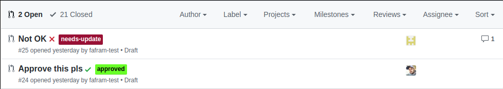

# Pull Request Workflow

This project aims to simplify the pull request overview on GitHub utilizing labels and assignee field, so that the pull request state is visible directly from the pull requests page.

It is a Java application that listens for [GitHub webhooks](https://developer.github.com/webhooks/) configured in your repository for various events connected with the pull requests.

When a `review` is `requested` from a user, the corresponding label is applied and the reviewer is `set as an assignee` of the PR - because now the pull request waits for the reviewer to provide a review.

If the reviewer `requests changes` in the PR, the label is applied and PR is `assigned back to the author` of the PR to do the changes needed.

On the `PR update`, previous reviews are `dismissed` and `rerequested` from all reviewers and also the PR is `assigned to them`.

Based on the configuration, if the `PR is approved` and it `fulfills all other conditions` (not draft, not wip, passing required checks, etc.) the `PR is automatically merged`.

 

## Configuration

The configuration is done via the [application.properties](./src/main/resources/application.properties) file in this repository. This file is only a `template` and ideally should not be changed.

Recommended approach is to create a `config` folder in the root of this repository and place the copy of `application.properties` file with your configuration there.

For more info about overriding the configuration at runtime, refer to the [quarkus guide on overriding the configuration](https://quarkus.io/guides/config#overriding-properties-at-runtime)

### GitHub permissions

The app reacts to the selected events emitted from GitHub using webhooks. 

If you are using GitHub app, you need to configure the webhooks in the app itself - go to `App settings`:

In `General`, setup `Webhook`:

- `Webhook URL` - url to the webhook endpoint of a running instance of this app
- `Webhook secret` - use any secret

in `Permissions & events`:

- `Repository permissions`
   - `Checks` - read & write
   - `Contents` - read
   - `Issues` - read & write
   - `Metadata` - read
   - `Pull requests` - read & write
   - `Commit statuses` - read & write
- `Subscribe to events`
   - `Check run`
   - `Pull request`
   - `Pull request review`
   - `Status`

On the other hand, if you want to use account + token combination, you need to set up your repository to send the events: go to `Settings` -> `Webhooks` and add a new webhook:

- `Payload URL` - url to the webhook endpoint of a running instance of this app
- `Content Type` - use `application/json`
- `Secret` - use any secret

Since the app works only with a subset of the events, select only following events to subscribe to:
- `Check runs`
- `Pull requests`
- `Pull request reviews`
- `Statuses`

## Running the application

You can either run the application in docker container (preferred way) or as a standard java application.

### Docker

In this repository there is a [Dockerfile](./Dockerfile) used to build the docker image with the application. To build the docker image, use following commands:

```bash
./mvnw package
docker build . -t <image tag>
docker run -p <your preferred port>:8080 <image tag>
```

You can then access the application on `http://localhost:<your port>/webhook`

### Java app

You can also run the application as the standard Java application. Keep in mind that `pull-request-workflow-0.1-runner.jar` isn't a fat Jar (meaning it doesn't work as a standalone jar) and it always needs to have the associated `lib` folder present.

If you want to run the app from different directory, you can use these commands:

```bash
./mvn package
mkdir -pv /tmp/test
cp -r config/ /tmp/test
cp -r target/lib /tmp/test
cp target/pull-request-workflow-0.1-runner.jar /tmp/test

cd /tmp/test
java -jar pull-request-workflow-0.1-runner.jar
```

## Deploying the app

### Heroku

Easiest thing to do is to deploy the app as the docker web app. You can follow the instruction [here](https://devcenter.heroku.com/articles/container-registry-and-runtime), just to outline the basic steps, having logged in to the Heroku cli, use these commands:

```bash
heroku container:push -v -a <app name> web
heroku container:release -v -a <app name> web
```

You can then point your GitHub webhook to https://`heroku_app_url`/webhook.

### Kubernetes

Kubernetes related resources can be found in [deploy](deploy/k8s) directory. Change the config values in the [config map](deploy/k8s/01_configmap.yml) and if you use a custom built image, change that in the [deployment](deploy/k8s/05_deployment.yml) and then create the resources using:

```bash
kubectl create -f deploy/k8s
```

One of the resources is the k8s [ingress](https://kubernetes.io/docs/concepts/services-networking/ingress/) and you can point the webhook to http://`ingress_ip`/webhook. 


This project uses Quarkus, the Supersonic Subatomic Java Framework.

If you want to learn more about Quarkus, please visit its website: https://quarkus.io/ .
